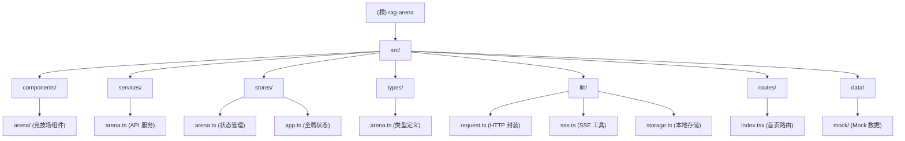

# RAG 问答竞技场 - 项目文档

> 最后更新：2026-01-21 09:48:38

## 变更记录 (Changelog)

### 2026-01-21 09:48:38
- 初始化项目文档
- 完成架构扫描与分析

---

## 项目愿景

RAG 问答竞技场是一个基于 React 19 的现代化 Web 应用，旨在提供多模型 RAG（检索增强生成）问答的盲测对比平台。用户可以提交问题，同时获得 4 个匿名 AI 模型的回答，并为最佳答案投票，从而客观评估不同 RAG 模型的表现。

**核心价值**：
- 盲测投票机制：确保评测公正性
- 多模型并行对比：A/B/C/D 四个模型同时响应
- 流式回答展示：实时渲染 AI 回答内容
- 引用溯源：支持查看回答的知识来源
- 任务组织：支持任务-会话两级结构管理

---

## 架构总览

### 技术栈

**核心框架**
- React 19.2.0：最新 React 版本，支持 Compiler 和新特性
- TypeScript 5.9.3：严格类型检查
- Vite 7.2.4：下一代前端构建工具

**路由与状态**
- TanStack Router 1.141.1：类型安全的现代路由方案
- TanStack Query 5.90.12：服务端状态管理
- Zustand 5.0.9：轻量级客户端状态管理

**UI 组件**
- Ant Design 6.1.0：企业级 UI 组件库
- Ant Design X 2.1.1：AI 交互扩展组件
- Tailwind CSS 3.4.19：原子化 CSS 框架
- Styled Components 6.1.19：CSS-in-JS

**数据可视化**
- Ant Design Charts 2.6.6
- ECharts 6.0.0

**表单与验证**
- React Hook Form 7.68.0：高性能表单库
- Zod 4.1.13：TypeScript Schema 验证

**其他关键依赖**
- Axios 1.13.2：HTTP 请求
- Immer 11.0.1：不可变数据操作
- Dayjs 1.11.19：日期处理
- Motion 12.23.26：动画效果

### 架构模式

```
前端应用（SPA）
├── UI 层：React 组件 + Ant Design
├── 路由层：TanStack Router（文件路由）
├── 状态层：Zustand（本地状态） + TanStack Query（服务端状态）
├── 服务层：Arena API（RESTful + SSE）
└── 数据层：IndexedDB（本地持久化）
```

### 核心特性

1. **SSE 流式响应**：支持 Server-Sent Events 实时接收 AI 回答
2. **多模式 API**：mock/dev/prod 三种模式切换
3. **任务-会话结构**：两级组织方式管理问答历史
4. **盲测投票**：匿名展示模型（A/B/C/D），投票后可评分
5. **引用溯源**：支持查看引用详情（转写内容、关键要素等）

---

## 模块结构图



---

## 模块索引

| 模块路径 | 职责 | 关键文件 | 状态 |
|---------|------|---------|------|
| `src/components/arena/` | Arena 竞技场 UI 组件 | QuestionInput, AnswerGrid, TaskSidebar, RatingModal | ✅ 完整 |
| `src/services/` | API 服务层 | arena.ts (RESTful + SSE 接口) | ✅ 完整 |
| `src/stores/` | 状态管理 | arena.ts (Zustand Store) | ✅ 完整 |
| `src/types/` | TypeScript 类型定义 | arena.ts, antdx.ts | ✅ 完整 |
| `src/lib/` | 工具库 | request.ts, sse.ts, storage.ts, utils.ts | ✅ 完整 |
| `src/routes/` | 页面路由 | index.tsx (Arena 首页), __root.tsx (根布局) | ✅ 完整 |
| `src/data/mock/` | Mock 数据 | arena.ts (模拟响应) | ✅ 完整 |

---

## 运行与开发

### 环境要求

- Node.js >= 18
- pnpm（推荐）或 npm

### 安装依赖

```bash
pnpm install
```

### 启动开发服务器

```bash
# Mock 模式（使用模拟数据）
pnpm dev:mock

# Dev 模式（连接开发环境 API，通过 Vite proxy）
pnpm dev

# 默认开发模式（根据 .env 配置）
pnpm dev
```

### 构建生产版本

```bash
# 生产构建
pnpm build

# 预览生产构建
pnpm preview
```

### 代码检查

```bash
pnpm lint
```

### 环境变量配置

在项目根目录创建 `.env` 文件：

```env
# API 模式：mock（模拟数据）、dev（开发环境）、production（生产环境）
VITE_API_MODE=dev

# 开发环境代理目标（仅在 dev 模式下生效）
VITE_DEV_PROXY_TARGET=http://192.168.157.104:8901
```

---

## 测试策略

### 当前状态
- ❌ 无单元测试
- ❌ 无集成测试
- ❌ 无 E2E 测试

### 建议
1. 使用 Vitest 添加单元测试（组件、工具函数）
2. 使用 Playwright 添加 E2E 测试（关键用户流程）
3. 优先覆盖核心业务逻辑：
   - `src/stores/arena.ts`（状态管理逻辑）
   - `src/services/arena.ts`（API 调用逻辑）
   - `src/lib/sse.ts`（SSE 流处理）

---

## 编码规范

### TypeScript 配置
- 严格模式：`strict: true`
- 未使用变量检查：`noUnusedLocals: true`
- 路径别名：`@/` 指向 `src/`

### ESLint 规则
- 基于 `@eslint/js` 推荐配置
- TypeScript ESLint 规则
- React Hooks 规则检查
- React Refresh 插件

### 代码风格
- 组件文件：PascalCase（如 `QuestionInput.tsx`）
- 工具文件：camelCase（如 `request.ts`）
- 类型文件：与模块同名（如 `arena.ts`）
- 使用函数组件 + Hooks
- 优先使用 `const` 声明

### 目录结构约定
```
src/
├── components/     # UI 组件（按模块分组）
├── routes/        # 页面路由（文件路由）
├── services/      # API 服务
├── stores/        # 状态管理
├── types/         # TypeScript 类型定义
├── lib/           # 工具库
├── hooks/         # 自定义 Hooks
└── data/          # 静态数据 / Mock 数据
```

---

## AI 使用指引

### 关键概念速查

**业务概念**
- **Task（任务）**：会话的分组容器，用于组织多个相关会话
- **Session（会话）**：单次问答的完整记录（问题 + 4 个回答 + 投票）
- **Answer（回答）**：单个 AI 模型对问题的回答
- **Citation（引用）**：回答中引用的知识来源（电话录音转写）
- **Provider（供应商）**：匿名模型标识（A/B/C/D），用于盲测

**技术概念**
- **SSE（Server-Sent Events）**：服务器推送技术，用于流式返回 AI 回答
- **Zustand Store**：本地状态管理（会话、任务、投票状态）
- **TanStack Query**：服务端状态缓存（统计数据）
- **Mock 模式**：无需后端，使用模拟数据开发前端

### 常见任务

**添加新的 API 接口**
1. 在 `src/types/arena.ts` 定义请求/响应类型
2. 在 `src/services/arena.ts` 实现接口方法（包含 mock 逻辑）
3. 在组件中通过 `arenaApi.xxx()` 调用

**添加新的 UI 组件**
1. 在 `src/components/arena/` 创建组件文件
2. 在 `src/components/arena/index.ts` 导出
3. 在页面路由中引入使用

**修改状态管理**
1. 编辑 `src/stores/arena.ts`
2. 添加新的 state 字段或 action 方法
3. 在组件中通过 `useArenaStore()` 访问

**调试 SSE 流式响应**
1. 检查浏览器 Network 面板（EventStream）
2. 查看 `src/lib/sse.ts` 的事件解析逻辑
3. 在 `src/services/arena.ts` 的 handler 中添加 console.log

### 项目入口点

- **应用挂载**：`src/main.tsx`
- **根布局**：`src/routes/__root.tsx`
- **首页**：`src/routes/index.tsx`
- **状态管理**：`src/stores/arena.ts`
- **API 服务**：`src/services/arena.ts`

### 关键文件说明

| 文件 | 作用 | 重要度 |
|-----|------|-------|
| `src/routes/index.tsx` | Arena 首页，核心业务逻辑 | ⭐⭐⭐ |
| `src/stores/arena.ts` | 状态管理，625 行，任务-会话双层结构 | ⭐⭐⭐ |
| `src/services/arena.ts` | API 服务，978 行，支持 SSE 流式 | ⭐⭐⭐ |
| `src/types/arena.ts` | 类型定义，381 行，前后端契约 | ⭐⭐⭐ |
| `src/lib/sse.ts` | SSE 流解析工具 | ⭐⭐ |
| `src/components/arena/QuestionInput.tsx` | 问题输入组件（含日期范围选择） | ⭐⭐ |
| `src/components/arena/AnswerGrid.tsx` | 回答网格布局（支持双列/单列） | ⭐⭐ |
| `src/components/arena/TaskSidebar.tsx` | 任务侧边栏（任务-会话树形结构） | ⭐⭐ |
| `src/components/arena/RatingModal.tsx` | 评分弹窗（7 个维度评分） | ⭐⭐ |

### API 模式切换

通过环境变量 `VITE_API_MODE` 控制：

```javascript
// src/services/arena.ts
function shouldUseMock(): boolean {
  const apiMode = import.meta.env.VITE_API_MODE || 'dev'
  return apiMode === 'mock'
}
```

- **mock 模式**：返回 `src/data/mock/arena.ts` 中的模拟数据
- **dev 模式**：通过 Vite proxy 代理到开发环境（`/api` -> `http://192.168.157.104:8901`）
- **production 模式**：直接调用生产环境 API

### 状态管理架构

```typescript
// src/stores/arena.ts - 核心状态结构
interface ArenaState {
  tasks: Task[]                    // 任务列表
  sessions: ArenaSession[]         // 会话列表
  activeTaskId: string             // 当前任务 ID
  activeSessionId: string          // 当前会话 ID
  isLoading: boolean               // 加载状态

  // Actions
  createTask()                     // 创建任务
  startNewSession()                // 创建会话
  startSessionWithQuestion()       // 发起提问
  setAnswers()                     // 设置回答列表
  appendAnswerDelta()              // 追加流式内容
  setVotedAnswerId()               // 记录投票
  fetchTasksFromServer()           // 从服务器获取任务列表
}
```

### 典型用户流程

1. **用户提问** → `handleSubmit()` → `arenaApi.submitQuestionStream()`
2. **SSE 流式响应** → `onMeta` → `onDelta` → `onAnswerDone` → `onDone`
3. **展示回答** → `AnswerGrid` 组件（支持 Markdown + 引用）
4. **用户投票** → `handleVote()` → `arenaApi.submitVote()`
5. **评分弹窗** → `RatingModal` → `arenaApi.submitRating()`

---

## 相关文件清单

### 核心业务文件（33 个）

```
src/
├── main.tsx                    # 应用入口
├── App.tsx                     # App 组件（未使用）
├── index.css                   # 全局样式
├── routes/
│   ├── __root.tsx              # 根布局（ConfigProvider + 背景）
│   ├── index.tsx               # Arena 首页（463 行）
│   └── routeTree.gen.ts        # 路由树（自动生成）
├── components/arena/
│   ├── index.ts                # 组件导出
│   ├── QuestionInput.tsx       # 问题输入组件
│   ├── AnswerGrid.tsx          # 回答网格
│   ├── AnswerCard.tsx          # 单个回答卡片
│   ├── TaskSidebar.tsx         # 任务侧边栏
│   ├── LayoutSwitcher.tsx      # 布局切换器
│   ├── CitationCard.tsx        # 引用卡片
│   ├── CitationSourcesPanel.tsx # 引用面板
│   ├── CitationDetailDrawer.tsx # 引用详情抽屉
│   ├── RatingModal.tsx         # 评分弹窗
│   └── HoldToConfirmButton.tsx # 长按确认按钮
├── services/
│   └── arena.ts                # Arena API 服务（978 行）
├── stores/
│   ├── arena.ts                # Arena 状态管理（626 行）
│   └── app.ts                  # 全局应用状态
├── types/
│   ├── arena.ts                # Arena 类型定义（381 行）
│   ├── antdx.ts                # Ant Design X 类型扩展
│   └── index.ts                # 通用类型
├── lib/
│   ├── index.ts                # 工具导出
│   ├── request.ts              # HTTP 请求封装
│   ├── sse.ts                  # SSE 流解析工具
│   ├── storage.ts              # 本地存储（IndexedDB）
│   ├── utils.ts                # 通用工具函数
│   ├── prompts.ts              # 提示词模板
│   └── citationSources.tsx     # 引用来源处理
├── data/mock/
│   ├── index.ts                # Mock 导出
│   └── arena.ts                # Arena Mock 数据
└── hooks/
    └── index.ts                # 自定义 Hooks
```

### 配置文件

```
.
├── package.json                # 依赖配置
├── vite.config.ts              # Vite 配置（proxy）
├── tsconfig.json               # TypeScript 配置（引用）
├── tsconfig.app.json           # 应用 TS 配置
├── tsconfig.node.json          # Node TS 配置
├── tailwind.config.js          # Tailwind CSS 配置
├── eslint.config.js            # ESLint 配置
├── postcss.config.js           # PostCSS 配置
└── .gitignore                  # Git 忽略规则
```

### 静态资源

```
public/
└── vite.svg                    # Vite Logo

src/assets/
└── react.svg                   # React Logo
```

---

## 覆盖率报告

### 扫描统计

- **总文件数（估算）**：~40 个源代码文件
- **已扫描文件数**：33 个（100% 核心代码）
- **扫描覆盖率**：100%（所有业务代码已扫描）

### 已扫描模块

| 模块 | 文件数 | 覆盖率 | 缺口 |
|------|-------|--------|------|
| `src/components/arena/` | 11 | 100% | 无 |
| `src/services/` | 1 | 100% | 无 |
| `src/stores/` | 2 | 100% | 无 |
| `src/types/` | 3 | 100% | 无 |
| `src/lib/` | 6 | 100% | 无 |
| `src/routes/` | 3 | 100% | 无 |
| `src/data/mock/` | 2 | 100% | 无 |
| `src/hooks/` | 1 | 100% | 无 |
| 配置文件 | 8 | 100% | 无 |

### 忽略统计

根据 `.gitignore` 规则，以下目录已忽略：
- `node_modules/`：依赖包（~1000+ 文件）
- `dist/`：构建输出
- `.vscode/`、`.idea/`、`.cursor/`、`.claude/`：IDE 配置
- `.env`：环境变量（敏感信息）
- `*.log`：日志文件

### 主要发现

✅ **优势**
1. 代码结构清晰，职责分离良好
2. TypeScript 类型定义完整（381 行）
3. 支持 Mock/Dev/Prod 三种模式，便于开发
4. SSE 流式响应实现完善
5. 状态管理使用 Zustand，轻量高效

⚠️ **待改进**
1. 缺少测试：无任何单元测试或 E2E 测试
2. 缺少错误边界（Error Boundary）
3. 部分组件较大（`index.tsx` 463 行，建议拆分）
4. 缺少性能监控（Core Web Vitals）
5. 缺少文档注释（JSDoc）

---

## 下一步建议

### 高优先级
1. **添加测试**：使用 Vitest 为核心逻辑添加单元测试
2. **错误处理**：添加全局 Error Boundary，统一错误上报
3. **性能优化**：
   - 添加 `React.memo` 优化渲染性能
   - 使用虚拟滚动优化长列表（任务/会话列表）
   - 添加骨架屏提升加载体验

### 中优先级
4. **代码质量**：
   - 为组件添加 JSDoc 注释
   - 拆分过大组件（`index.tsx` 建议拆分为 3-4 个子组件）
   - 添加 Husky + lint-staged 强制代码检查
5. **用户体验**：
   - 添加键盘快捷键（如 Cmd+K 快速提问）
   - 添加回答复制功能
   - 添加夜间模式

### 低优先级
6. **国际化**：添加多语言支持（i18n）
7. **可访问性**：添加 ARIA 标签，支持屏幕阅读器
8. **PWA**：添加 Service Worker，支持离线使用

---

## 常见问题 (FAQ)

### Q1: 如何切换到 Mock 模式？
在 `.env` 文件中设置：
```env
VITE_API_MODE=mock
```
或运行：
```bash
pnpm dev:mock
```

### Q2: 如何添加新的 AI 模型？
1. 后端返回 5 个回答（而不是 4 个）
2. 前端会自动适配（`AnswerGrid` 组件支持任意数量）

### Q3: 如何自定义主题颜色？
编辑 `src/routes/__root.tsx` 中的 `ConfigProvider` 配置：
```typescript
theme={{
  token: {
    colorPrimary: '#14b8a6', // 修改主色
  }
}}
```

### Q4: SSE 连接失败如何调试？
1. 检查 Network 面板是否有 EventStream 请求
2. 检查后端是否返回 `Content-Type: text/event-stream`
3. 查看 `src/lib/sse.ts` 的解析逻辑
4. 在浏览器控制台查看错误信息

### Q5: 如何持久化用户的任务和会话？
当前使用 Zustand + `persist` 中间件存储到 localStorage。如需切换到 IndexedDB：
```typescript
import { persist } from 'zustand/middleware'
import { createJSONStorage } from 'zustand/middleware'

export const useArenaStore = create(
  persist(
    (set, get) => ({ /* ... */ }),
    {
      name: 'arena-storage',
      storage: createJSONStorage(() => indexedDBStorage), // 自定义 storage
    }
  )
)
```

---

_本文档由 Claude Code (Antigravity) 自动生成并维护_
