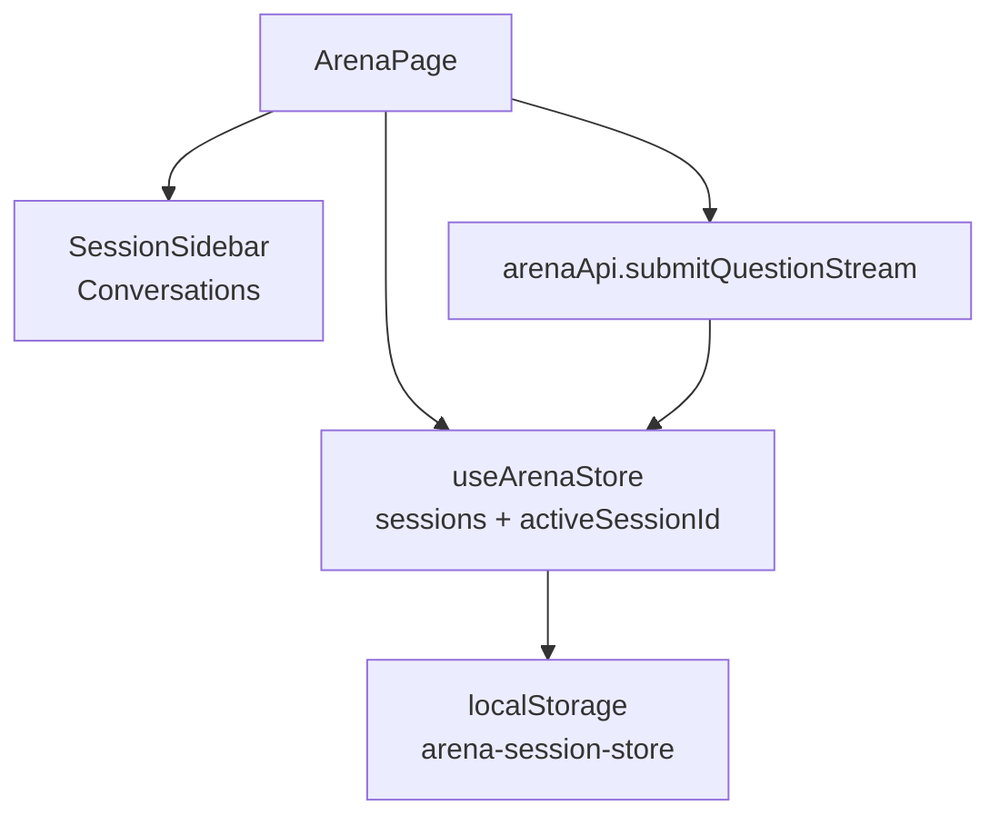

# 技术设计: Arena 侧边栏历史会话列表

## 技术方案

### 核心技术
- React + TypeScript
- Zustand（状态管理）+ `persist`（本地持久化）
- Ant Design + `@ant-design/x`（`Conversations` / `Sender`）

### 实现要点
- 会话数据结构以“单次提问”为最小会话单元：
  - `id`（本地会话 id）
  - `createdAt/updatedAt`
  - `question`、`serverQuestionId`（服务端 questionId，可为空）
  - `answers`（含流式 delta 追加、最终 citations）
  - `votedAnswerId`
- Zustand store 以 `sessions + activeSessionId` 为 SSOT；页面展示从 active session 派生
- 流式回调（`onMeta/onDelta/onAnswerDone/onAnswerError`）仅更新当前 active session，避免跨会话串写
- 本地持久化仅保存 `sessions/activeSessionId`，不持久化 `isLoading/isVoting` 等瞬态字段
- 侧边栏 UI 使用 `@ant-design/x` 的 `Conversations`：
  - `items`: 会话列表（按更新时间倒序）
  - `creation`: “新建会话”按钮
  - `menu`: 会话操作（最小提供“删除”）
- 为避免 `QuestionInput` 内部 state 在切换会话时残留，使用 `key={activeSessionId}` 强制重挂载

## 架构设计

## 安全与性能
- **安全:**
  - 不在本地存储写入密钥/令牌
  - 会话内容仅保存在用户浏览器本地
- **性能:**
  - 限制最大会话数量（例如 50），避免无限增长
  - 流式 delta 采用批量刷新（现有实现）减少重渲染压力

## 测试与部署
- **测试:** 以手工回归为主（当前仓库未配置自动化测试）
  - 新建会话 → 提问（流式） → 回答渲染正常
  - 切换到历史会话 → 内容恢复正确
  - 删除会话（含删除当前会话）→ 自动切换逻辑正确
- **部署:** 前端静态构建，无额外部署要求

