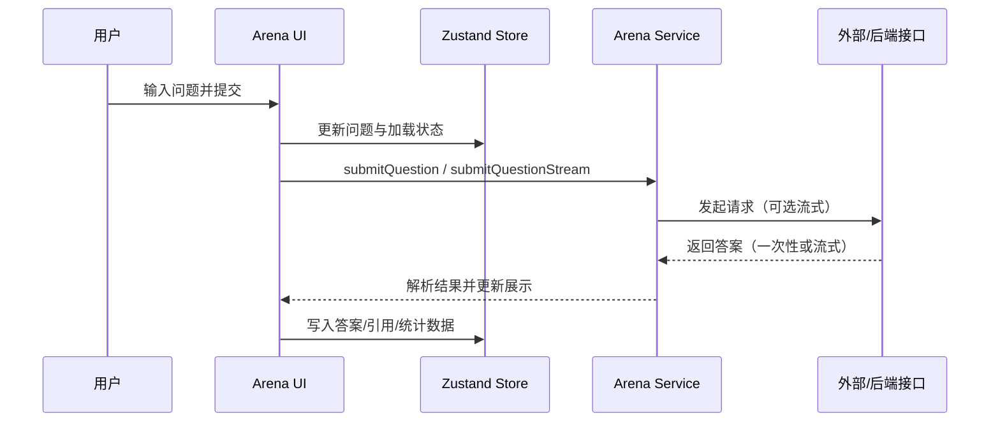

# 架构设计

## 总体架构

```mermaid
flowchart TD
  U[用户/浏览器] --> R[React 应用]
  R --> RT[TanStack Router]
  R --> UI[组件层<br/>src/components]
  UI --> ST[状态层<br/>Zustand stores]
  UI --> Q[数据获取<br/>React Query]
  Q --> S[服务层<br/>src/services]
  S --> HTTP[HTTP(S) 请求<br/>axios/fetch]
  S --> SSE[流式请求<br/>text/event-stream]
  HTTP --> EXT[外部/后端接口（可选）]
  SSE --> EXT
  ST --> LS[本地持久化<br/>localStorage（app-store）]
```

---

## 技术栈
- **前端:** React + TypeScript + Vite
- **路由:** TanStack Router（文件路由）
- **状态:** Zustand（本地状态）+ React Query（服务端状态）
- **UI:** Ant Design / @ant-design/x
- **数据/存储:** localStorage（当前为主），可按需引入 IndexedDB（依赖已包含）
- **网络:** axios（基础封装）与 fetch（流式场景）

---

## 核心流程



---

## 重大架构决策

完整的 ADR 存储在各变更的 `how.md` 中，本章节提供索引。

| adr_id | title | date | status | affected_modules | details |
|--------|-------|------|--------|------------------|---------|

